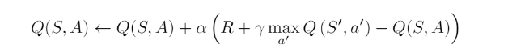
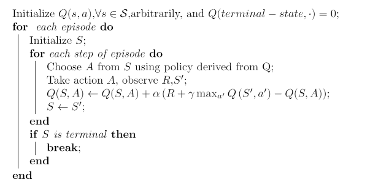
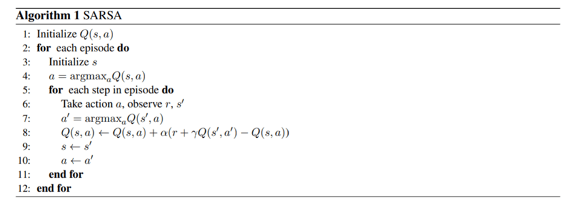
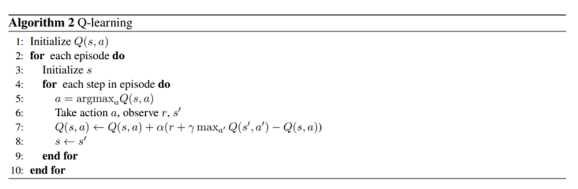
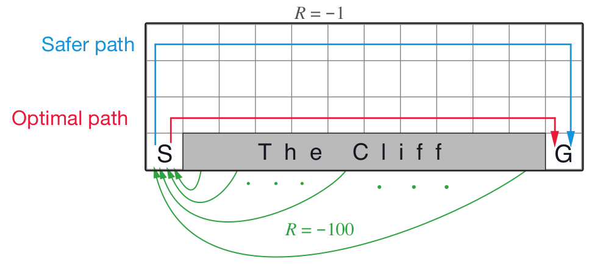
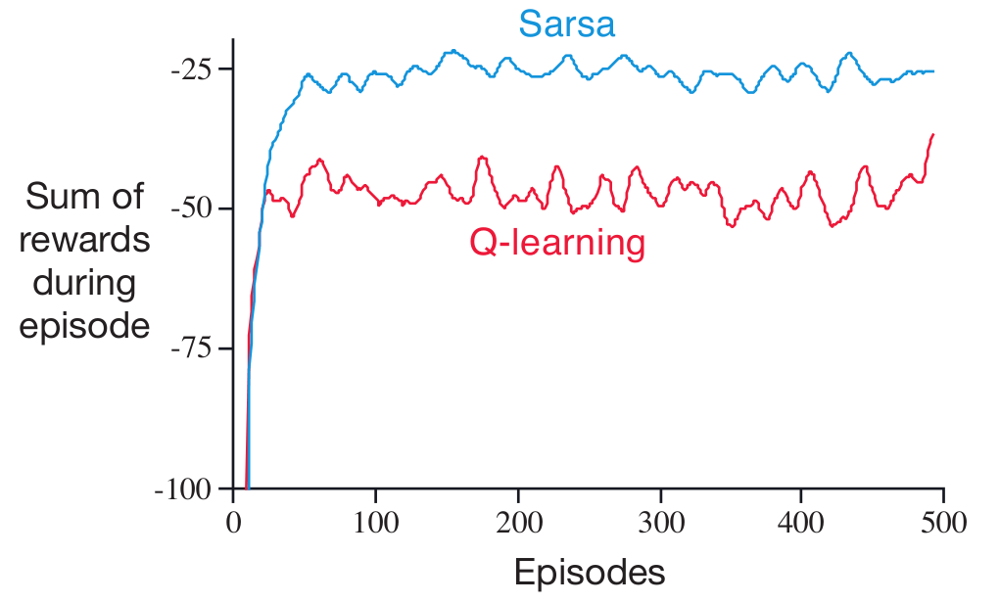
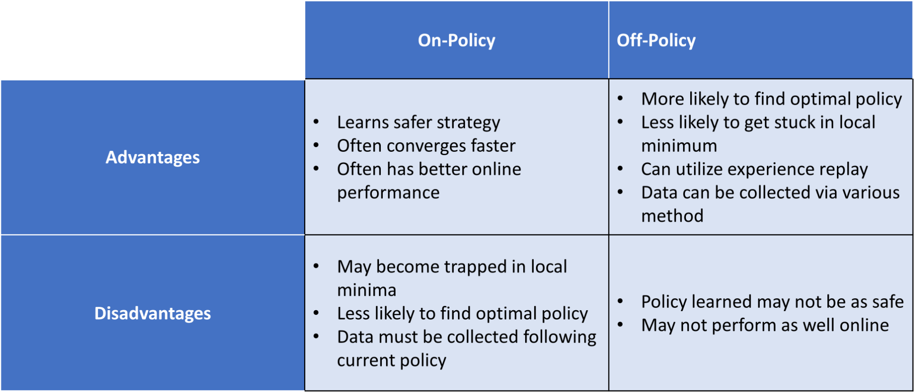

## Q-learning explanation
### Introduction to Reinforcement Learning:
Q-learning: Q-learning is a model-free reinforcement learning algorithm used to learn the quality of actions (Q-values) in a Markov decision process (MDP) environment. The algorithm aims to learn an action-value function 

Q(s,a) that represents the expected cumulative future rewards of taking action 
a in state s.

- Reinforcement Learning (RL) is a subfield of machine learning concerned with how agents learn to make decisions in an environment to maximize rewards.
- RL algorithms learn through trial and error, interacting with an environment and receiving feedback in the form of rewards or penalties.
### Q-Learning Overview:
- Q-Learning is a model-free RL algorithm used to learn the optimal action-selection policy in a Markov Decision Process (MDP).
- It estimates the quality of actions (Q-values) for each state-action pair and learns to select actions that maximize expected cumulative rewards.
### Cliff Walking Environment:
- The Cliff Walking environment is a classic grid world problem where an agent must navigate a grid while avoiding falling off a cliff.
- The objective is to reach the goal state while accumulating rewards and avoiding falling off the cliff.
### Key Components of the Code:
- Epsilon-Greedy Policy Functions: Balances exploration and exploitation during action selection.
- Q-Learning Function: Updates Q-values based on rewards received during interaction with the environment.
- Plotting Function: Visualizes average rewards obtained during training for different epsilon values.
### Exploration-Exploitation Dilemma:
- Epsilon-greedy policy balances exploration (random actions) and exploitation (choosing the best-known actions) during training.
- Epsilon parameter controls the exploration rate: higher epsilon encourages more exploration, while lower epsilon focuses more on exploitation.
### Update Rule:
- Q-Learning updates Q-values based on the rewards received and estimates the expected cumulative rewards for each state-action pair.
- Learning rate (alpha) determines how much new information overrides old information in the Q-value updates.
- Discount factor (gamma) balances immediate rewards against future rewards in the Q-value updates.

### Experimental Setup:
- Iterating through different epsilon values to investigate their impact on learning and performance.
- Plotting average rewards obtained over episodes for each epsilon value.

## Parameters

1. alpha:

This parameter, often denoted as α , represents the learning rate in the Q-learning algorithm.
It determines to what extent newly acquired information overrides old information.
A higher alpha means that the agent gives more weight to the most recent information when updating the Q-values.
A lower alpha means that the agent gives less weight to the most recent information, potentially relying more on past experiences.
It is a value between 0 and 1, where:
0 means the agent doesn't learn from new information (no updates to Q-values).
1 means the agent completely overrides old information with new information (full updates to Q-values).
In the provided code, alpha is set to 0.1 by default but can be adjusted as needed.
2. episode_num:

This parameter determines the number of episodes the agent will run during the Q-learning process.
An episode represents a single run of the agent interacting with the environment from start to finish.
More episodes allow the agent to gather more experience and potentially learn better policies.
In the provided code, episode_num is set to 1000 by default but can be adjusted based on the problem's complexity and desired training time.
3. discount_factor:

Also known as the discount factor, often denoted as
γ, it represents how much the agent values future rewards compared to immediate rewards.
It is a value between 0 and 1, where:
0 means the agent only cares about immediate rewards (short-term focus).
1 means the agent values future rewards as much as immediate rewards (long-term focus).
The discount factor allows the agent to make decisions that consider future consequences, even if they are delayed.
In the provided code, discount_factor is set to 1.0 by default, indicating that the agent values future rewards equally to immediate rewards.

## Q-learning formula

- Q-learning is an off-policy learning. Off-policy, compared with on-policy, is more powerful and general, often of greater variance and slower convergence. Its update equation is that.

## Explanation of Q-Learning for Optimal Path Selection:

1. Q-Value Iteration: 
- Q-Learning iteratively updates the Q-values based on the rewards received by the agent while exploring the environment. These updates are guided by the Bellman equation, which relates the value of a state-action pair to the expected immediate reward and the discounted value of the next state.

2. Greedy Policy:
- After learning the Q-values, Q-Learning employs a greedy policy to select actions. The greedy policy selects the action with the highest Q-value for each state, ensuring that the agent chooses actions that are expected to lead to the highest cumulative rewards.

3. Exploration vs. Exploitation:
- To balance exploration and exploitation, Q-Learning also incorporates an epsilon-greedy policy. This policy allows the agent to explore new actions with a certain probability (epsilon) while still exploiting the best-known actions based on the learned Q-values.

4. Convergence to Optimal Policy:
- Through repeated interactions with the environment and updates to the Q-values, Q-Learning converges to the optimal policy that maximizes cumulative rewards over time. The agent learns to choose actions that lead to higher rewards and avoid actions that lead to lower rewards or penalties.

#### Optimality: 
Q-Learning aims to find the optimal policy for maximizing cumulative rewards, leading to the selection of the best possible actions in each state. This results in the agent following the optimal path to achieve its objectives.

#### Adaptability: 
Q-Learning is a model-free reinforcement learning algorithm, meaning it does not require a model of the environment's dynamics. This makes it highly adaptable to complex and unknown environments, where traditional planning methods may be impractical or infeasible.

##### Efficiency: 
Q-Learning updates Q-values based on the agent's experiences, allowing it to learn from past interactions with the environment. This iterative learning process enables the agent to improve its policy over time and converge to the optimal path efficiently.

##### Generalization: 
Q-Learning learns a policy that generalizes across similar states, allowing the agent to make informed decisions even in unseen states. This generalization capability enhances the agent's ability to navigate diverse environments and handle varying situations effectively.

## off-policy advantage 

### 1.  Learning Approach:
- SARSA:
SARSA is an on-policy learning algorithm, meaning it learns the value of state-action pairs while following a specific policy (usually an epsilon-greedy policy). SARSA updates Q-values based on the action actually taken in the next state.
- Q-Learning:
Q-Learning is an off-policy learning algorithm, meaning it learns the value of state-action pairs while following a different policy (often a greedy policy). Q-Learning updates Q-values based on the action with the maximum Q-value in the next state, regardless of the action actually taken.

- SARSA often utilizes e-greedy behavior policy and follows the same policy when updating the Q-function, meaning that 
 is also selected based upon e greedy strategy as shown in Line 7. Thus, because SARSA learns the quality of the behavior policy rather than the quality of the optimal policy, SARSA is an on-policy algorithm.

The key difference between Q-learning and SARSA is the
 max(s',a')term found in the Q-learning algorithm. This max term means that Q-learning is learning the value of the optimal policy. SARSA’s Q-function models the q-values of the behavior policy whereas Q-learning learns the optimal q-values. This distinction is what makes SARSA on-policy and Q-learning off-policy.

## Convergence
- SARSA: SARSA converges to the optimal policy under certain conditions, particularly when using an epsilon-greedy policy and satisfying the requirements of the Markov property.
- Q-Learning: Q-Learning is known to converge to the optimal policy under more relaxed conditions compared to SARSA, making it more widely applicable in practice.

## Conclusion

In summary, SARSA and Q-Learning differ primarily in their learning approach, update rules, handling of exploration vs. exploitation, and convergence properties. SARSA is an on-policy learning algorithm that updates Q-values based on the action taken in the next state, while Q-Learning is an off-policy learning algorithm that updates Q-values based on the maximum Q-value in the next state. Understanding these differences is crucial for selecting the appropriate algorithm based on the specific requirements and characteristics of the reinforcement learning problem at hand.

